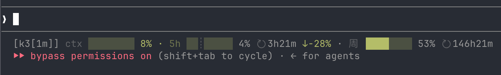
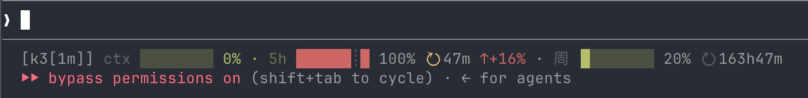
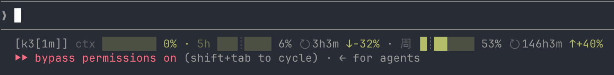

# claude-quota-statusline

> Claude Code 状态栏增强：在默认 statusline 上**叠加实时 5h/周配额 + 烧速预估 + 彩色阈值告警**，自动识别 Kimi / MiniMax，跨 session 共享缓存。



|  |  |  |
|:---:|:---:|:---:|
| 正常（绿/黄） | 5h 100% 红告警 | 周 ↑+40% 烧速警示 |

[](./LICENSE)
[](#依赖)
[](#测试)
[](https://www.gnu.org/software/bash/)

---

## 为什么要装

Claude Code 默认 statusline 只显示 model 名 + 上下文窗口。**你看不到自己的 5h 配额和周配额剩多少**，经常烧到 80% 才发现已经快 reset 了。

这个脚本在 statusline 末尾追加两段（5h + 周），按 burn rate 推算"按现在的烧速还能聊多久"，并且：

- **彩色告警**：≥85% 红、≥60% 黄，提前知道快没了
- **多服务商**：自动识别 Kimi / MiniMax，不用手动切
- **跨 session 共享缓存**：N 个 CC session 共一份 HTTP 响应，50s 内的请求零重复
- **优雅降级**：API 挂了就只显示已有字段，整条 statusline 不会消失

## 展示

```text
[Claude Sonnet 4.6] ctx ███░░░░░░ 35% · 5h ████░░░░░ 48% ↻ 2h13m ≈ 47m · 周 ███░░░░░░ 94/150 ↻ 32h7m ≈ 4h
```

四段信息从左到右：

- `[model]` — 当前 session 使用的模型名
- `ctx X%` — 上下文窗口已用百分比（与 Claude Code 右下角口径一致）
- `5h X% ↻ Ym ≈ Zh` — 5h 配额：已用百分比 + 距 reset 倒计时 + 按当前 burn rate 推算的对话剩余时长
- `周 X/Y ↻ Ym ≈ Zh` — 周配额：已用 / 总额（`X/Y` 形式，boost 时总额 > 100 显式标分母；无 boost 时退化为 `X%`）+ 距 reset 倒计时 + 对话余量

## 安装

### 一键安装

```bash
git clone https://github.com/cstdr/claude-quota-statusline.git
cd claude-quota-statusline
make install   # 等价于：cp statusline.sh ~/.claude/statusline.sh + chmod + 提示配置
```

### 手动安装

1. 复制脚本：

   ```bash
   cp statusline.sh ~/.claude/statusline.sh
   chmod +x ~/.claude/statusline.sh
   ```

2. 配置 Claude Code 使用本 statusline（`~/.claude/settings.json`）：

   ```json
   {
     "statusLine": {
       "type": "command",
       "command": "~/.claude/statusline.sh"
     }
   }
   ```

3. 设置环境变量（见下方「配置」）。

## 配置

需要以下环境变量之一（statusline 脚本会按顺序找）：

- `ANTHROPIC_AUTH_TOKEN` — Anthropic 兼容的 API token（推荐；Kimi / MiniMax 都用这个）
- `KIMI_API_KEY` — Kimi 专用 API key（provider=kimi 时的 fallback）
- `MINIMAX_API_KEY` — MiniMax 专用 API key（provider=minimax 时的 fallback）

服务商依 `ANTHROPIC_BASE_URL` 自动识别，不用额外配置；完整可调变量见 [`.env.example`](./.env.example)。

## 功能

- **双服务商**：依 `ANTHROPIC_BASE_URL` 自动识别 Kimi（`api.kimi.com/coding/v1/usages`）或 MiniMax（`/v1/token_plan/remains`）；识别不出（如官方 Anthropic / 其他代理）则跳过配额段、不发请求。`STATUSLINE_PROVIDER=kimi|minimax` 可强制覆盖
- **跨 session 共享缓存**：N 个 CC session 共用一份 cache，HTTP 流量降到 1/N，50s 刷新一次
- **彩色阈值告警**：
  - 用量（ctx / 5h / 周）：≥85% 红，≥60% 黄
  - reset 倒计时：< 30min 红，< 2h 黄
- **对话余量估算**（`≈Xh / ≈Ym`）：5 分钟 burn rate 窗口，账户级（所有 session 共一份历史）
- **周配额 boost 修正**：识别 `weekly_boost_permille`，与 MiniMax dashboard 数字一致
- **优雅降级**：stdin / API 任一失败都不让整条 statusline 变空，缺失字段静默省略
- **多模型支持**（默认关闭）：除 `general` 外，API 还返回 `video`（count 语义，如 0/3）。
  设置 `STATUSLINE_MULTI_MODEL=1` 启用，输出追加 `· video 0/3 ↻ 12m`

## 依赖

- `bash`（3.2+，POSIX sh 不够）
- `jq` — 解析 stdin JSON、配额 API 响应（Kimi 响应的 resetTime 换算也在 jq 里做）
- `curl` — 拉配额 API（Kimi 或 MiniMax）
- `awk`（BSD 或 GNU 均可）
- `stat`（macOS / Linux 都自带）

macOS 默认环境除 `jq` 外都齐全；用 `brew install jq` 补一个。

## 测试

160+ 断言覆盖所有纯函数（colorize / format / count-piece / burn-estimate / time-marker / kimi 解析）：

```bash
make test   # 或：./tests/run_all.sh
```

测试用 `STATUSLINE_LIB_MODE=1 source statusline.sh` 注入函数，纯 bash + `set -u`；kimi_fields 单测会真实调 jq（fixture 本地构造，不走网络）。开发新功能时遵循 TDD：先在 `tests/test_xxx.sh` 写测试 → 跑通 → 实现。

CI：每次 push / PR 都会自动跑 `make test`（`.github/workflows/test.yml`）。

## 工作原理

- **stdin**：每次 Claude Code tick 调用一次，注入 session JSON；提取 `model.display_name` + `context_window.used_tokens/max_tokens`
- **缓存层**：`/tmp/claude-statusline-<provider>-shared`，所有 session 共读，50s 内的请求都拿同一份
- **burn rate 历史**：`/tmp/claude-statusline-<provider>-burn`，每分钟写一行（epoch + 5h% + 周%），按 5 分钟窗口算 burn rate
- **POSIX 原子写**：单行 < 20B << PIPE_BUF (4KB)，POSIX 保证 `>>` 原子，不需要 `flock`

详细设计动机、踩坑记录见 [DESIGN.md](./DESIGN.md)。

## 常见问题 (Troubleshooting)

| 现象 | 原因 | 解法 |
|------|------|------|
| `jq: command not found` | macOS 默认没装 jq | `brew install jq` |
| statusline 出现 5h/周 段空白 | API 请求失败 / token 错 | 检查 `ANTHROPIC_AUTH_TOKEN` 是否对；或 `STATUSLINE_PROVIDER=minimax check_remains.sh` 手动调一次 |
| ctx 数字比 CC 右下角小 10% | 用了老字段 `used_percentage`（分母 = total） | 升级到新版（已用 `used_tokens / max_tokens`） |
| 配额永远不更新 | 缓存 50s 没过期是正常的；如果一直不更新 → API 401 | `rm /tmp/claude-statusline-*-shared` 清缓存 |
| `make install` 提示 `~/.claude/` 不存在 | 还没装过 Claude Code | 装一次 CC 再跑 install |

## 已知限制

- 不支持多账号（cache 和 burn rate 文件都是单实例，假设本机单用户）
- 多模型支持默认关闭，需要 `STATUSLINE_MULTI_MODEL=1`；目前只支持 `video`，更多 model 需扩展 `format_count_piece`
- 周配额的"bar"按绝对 USED 填充，不算 used/total 比例（详见 DESIGN.md「改动 6」取舍）

## 贡献

欢迎 issue / PR。改动前先开 issue 讨论（避免大改分歧），然后：

```bash
make test    # 单测全过再提
make lint    # shellcheck（如果装了）
```

## 许可

MIT License — 详见 [LICENSE](./LICENSE)。
